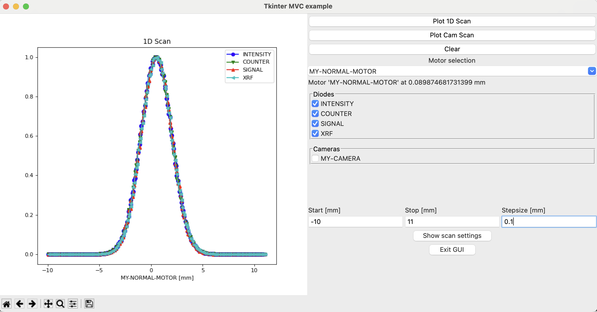
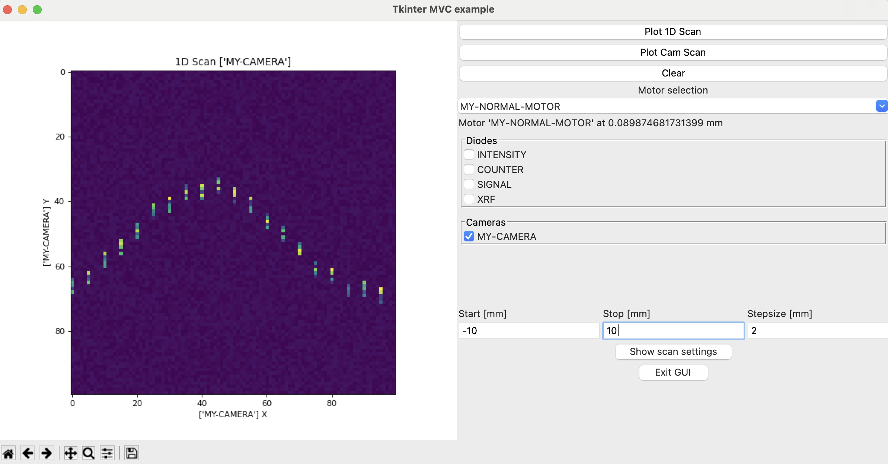

# Solution

## Task: Use the toy DAQ to write a GUI that performs a 1D scan
---

- Allow the user to select one motor
    <br> [x] Done 
- Allow the user to select N diodes
    <br> [x] Done 
- Show the signals of the N diodes as function of the motor position
    <br> [x] Done 
  (at least after the scan, but preferably live updating)
- live updating
    <br> [x] Done 
- Visualize a camera instead of a diode
    <br> [x] Done 

<table>
  <tr>
    <td>1D scan with diodes</td>
     <td>1D scan with a camera</td>

  </tr>
  <tr>
    <td valign="top"></td>
    <td valign="top"></td>
  </tr>
 </table>

## How to start the GUI? 

```py
python controller.py
```
My requirements are listed in requirements.txt.

## How did I solve the task?
---

### 1. Some market research : possible GUI libaries
Lots of possibilities on the market:
- easygui
- tkinker
- qt, pyqt:
 - Shiny for Python
 - flask

&#8594; Choice: **tkinter**
- built in Python
- no license issues, free 
- many users on stackoverflow
- "good" documentation on  https://anzeljg.github.io/rin2/book2/2405/docs/tkinter/index.html

### 2. Thoughs about the code:<br>
I chose  a Model-View-Controller (MVC) pattern for the task and followed object orientated programming.
The model (model.py) holds all information on the simulated beamline. This includes technically also scan methods, e.g. spiral scan, 2D scan. The view (view.py) has all code for the GUI. The controller (controller.py) is the glue between both and contains workflows and links events to buttons. It can call as well scan methods from the controller. This should ensure that when I exchange the GUI library and the model, the controller can still work.
I located functions like `get_diode_selection` (obtains selected diodes) in the `View`, but placed more advanced workflow procedures into the `Controller`, e.g. `create_scan_plot`. I tried to be as modular as possible.
This MVC patterns allows for separate unit testing. Timewise, I did not manage to implement unit tests. However the GUI is capable of handling some bad input parameters. For example, strings in the entry boxes are not allowed. A scan does not start if motor is not selected.

I implemented the scan method via `scan_iter`. It works, but using `scan` or `scan_thread` would allow for threading. With it, I could run threads and check/run in parallel the status of the GUI or multiple motors. 

### 3. Not implemented, but thought about it:
- Config.file to get hardware configuration
- Software limits for motors, once set, the user should not have access to them. Nobody wants to crash with a motor into other hardware components.
- Save scans or camera images
- Progressbar based on the already implemented function `show_progress`

### 4. Thoughts about your advanced challenges
    
1. Visualize a camera instead of a diode<br>
    Done. I provided a second button and a second procedure for this task. I could reuse some functions. But I thought it was easier to go for a seperate function/workflow.
    
2. Visualize the overall system status:<br>
    I think there are several options. 
    - Another class that observes the events, e.g. an Observable class.
    - An event queue. View pushes events into this queue and the controller on a different thread pops them/listens to them.
    - In general threading.<br>
    - The `scan` function had this callback option implemented.
    - Writing a log file and visualises this? But probably the worst option.
    
    &nbsp;<br>

3. Visualize progress (e.g., how long until done) during the scan<br>
    This would also require threading, I think. `tkinter` has an `update` function. I have not tried it out. My GUI version can show the progress in the command line based on your `show_progress`.
    I tried to send updated motor values to my view motor label, but tkinter stopped after one iteration. I assume this requires the implementation of the `update` function.
&nbsp;<br>
4. Progress updates via other channels (browser/SMS/email/...)<br>
    Email option probably via `smtplib` library.
    


